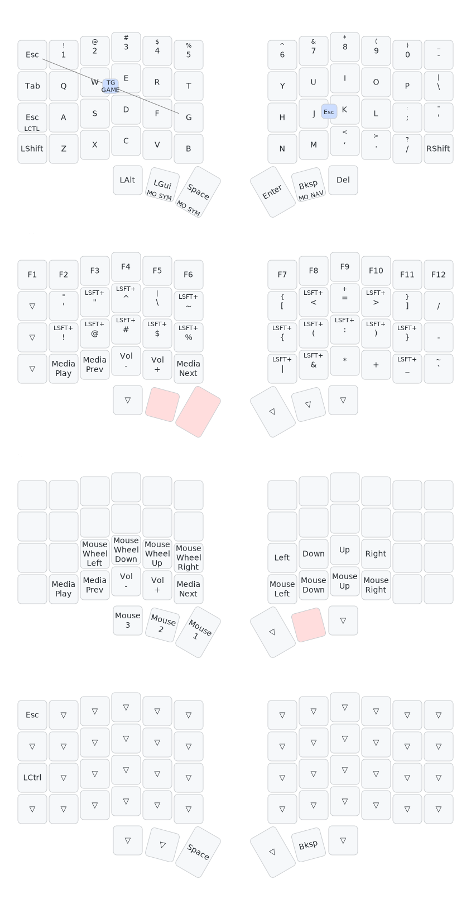

# Silakka54 VIAL Layout

Custom VIAL layout for the Silakka54 54-key keyboard by Leon Trestman, designed for productivity and gaming.

## Layers

- **DEF:** Standard typing with dual-function keys (`Esc+Ctrl`, `LGui/Space → SYM`, `Bksp → NAV`)
- **SYM:** F1–F12, symbols, shifted characters, media & volume controls
- **NAV:** Arrow keys, mouse movement, scroll wheel, additional media controls
- **GAME:** Minimal keys for gaming (`Esc`, `LCtrl`, `Space`, `Bksp`), designed to stay as close as possible to the stock layout while keeping the symbol layer accessible

## Combos

- `J + K` → Send `Esc`
- `Esc + G` → Toggle `GAME` layer
